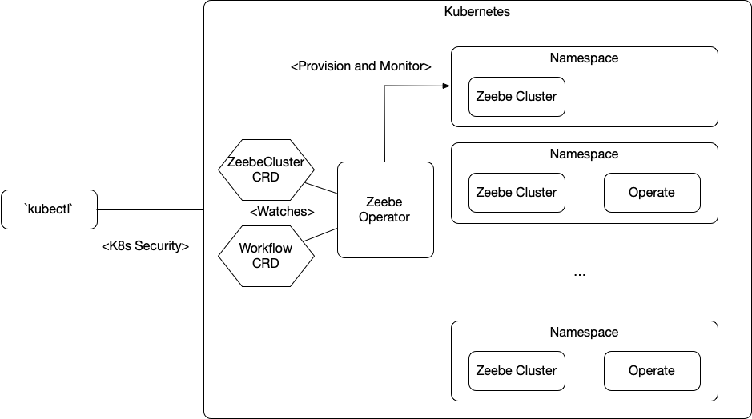

# Zeebe Kubernetes Operator
The Zeebe Kubernetes Operator was designed to ease the provisioning and monitoring of Zeebe Clusters and related components. 
This is achieved by defining a set of Custom Resource Definitions for a ZeebeCluster and other types. 
This allows us to extend Kubernetes capabilities to now understand how to properly provision, manage and monitor Zeebe Clusters. 

## Installation
The Zeebe Kubernetes Operator can be installed using Helm

> helm repo add zeebe http://helm.zeebe.io

> helm install zeebe-operator zeebe/zeebe-operator

## Basic Usage


A new Zeebe Cluster can be created, after installing the operator, by applying the following manifest:

``` simple-zeebe-cluster.yaml
apiVersion: zeebe.io/v1
kind: ZeebeCluster
metadata:
  name: my-zeebe-cluster
```

You can do that by running: 
> kubectl apply -f simple-zeebe-cluster.yaml

You can list all the Zeebe Clusters with:
> kubectl get zb

If you want to delete an existing Zeebe Cluster you can just delete the `zb` resource:

> kubectl delete zb my-zeebe-cluster

Each ZeebeCluster is created on its own `Kubernetes Namespace` named after the ZeebeCluster resource (in this case `my-zeebe-cluster`) that means that you can list all the `Pods` for the cluster and associated resources by running
> kubectl get pods -n my-zeebe-cluster


## Architecture

From an architectural point of view the Zeebe Kubernetes Operator tries to reuse as much as possible existing resources and tools to provision Zeebe Cluster and associated components. 
Some of the tools that are used are:
- KubeBuilder v2 
- Tekton CD
- Helm 
- Zeebe Helm Charts
- Third Party Helm Charts such as: ElasticSearch, Kibana, Prometheus. 



The architecture of the Operator is quite simple, it creates [Tekton Pipelines](http://tekton.dev) to Deploy the existing Zeebe Helm Charts into the cluster where the Operator is installed.
 
It does this by using a version stream repository (source of truth) which define which versions of the charts needs to be used to provision a concrete cluster. 
This Version Stream repository contains a parent chart that will be installed when a cluster wants to be provisioned. You can find this repository [here](https://github.com/zeebe-io/zeebe-version-stream-helm)

Once the cluster is provisioned (by installing the [Zeebe Helm Charts](http://helm.zeebe.io)) the Operator is in charge of monitoring the resources that were created. For a Zeebe Cluster this are: 
- **Zeebe Broker(s)**: one or more brokers created by an StatefulSet
- **Zeebe Gateway**: Standalone Gateway which is created by a Deployment
- **Camunda Operate**: If enabled a Deployment is created

The status of this components is reflected into the `ZeebeCluster` (zb) resource that you can query by using `kubectl`

> kubectl describe zb my-zeebe-cluster

The Operator latest version also includes a more native Zeebe Health Check by using the Zeebe Go Client Library to connect to the provisioned clusters and check their health status. 
This can be enabled by setting the following property to true: 

```yaml
apiVersion: zeebe.io/v1
kind: ZeebeCluster
metadata:
  name: my-zeebe-cluster
spec:
  zeebeHealthChecksEnabled: true
``` 
The Zeebe Health Check Report can be found in the `ZeebeCluster` Resource `.Status.ZeebeHealthReport`

You can also enable a deployment of **Camunda Operate** for your Zeebe Cluster by setting the following property to true

```yaml
apiVersion: zeebe.io/v1
kind: ZeebeCluster
metadata:
  name: my-zeebe-cluster
spec:
  operateEnabled: true
``` 

### Operator Flow to provision a Cluster

As mentioned before

## Custom Resource Definitions(CRDs)
There are currently two Custom Resource Definitions (CRDs) supported by the `Zeebe Operator`
- ZeebeCluster Properties (.Spec)
    - `clusterType`:
    - `serviceName`:
    - `elasticSearchEnabled`:
    - `elasticSearchHost`:
    - `elasticSearchPort`:
    - `kibanaEnabled`:
    - `prometheusEnabled`:
    - `operateEnabled`:
    - `zeebeHealthChecksEnabled`:
- Workflow Properties (.Spec)
    - `clusterName`: 
    - `workflowDefinitionName`:
    - `workflowDefinitionContent`:

## Deploying workflows to different clusters using only `kubectl`


## References and Links
- [First iteration Blog Post](https://salaboy.com/2019/12/20/zeebe-kubernetes-operator/)
- [Tekton Kubernetes Native CI/CD](http://tekton.dev)
- [Helm](http://helm.sh)
- [Zeebe Helm Charts](http://helm.zeebe.io)
  


touch
